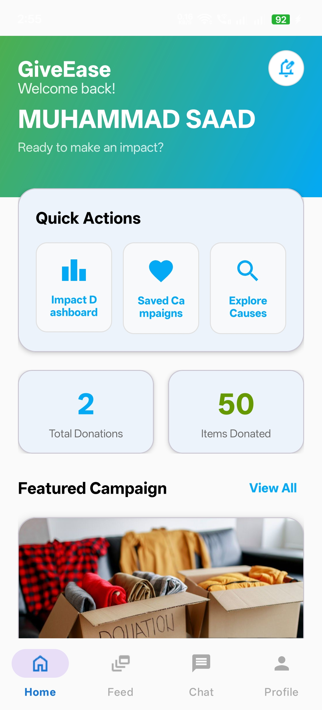
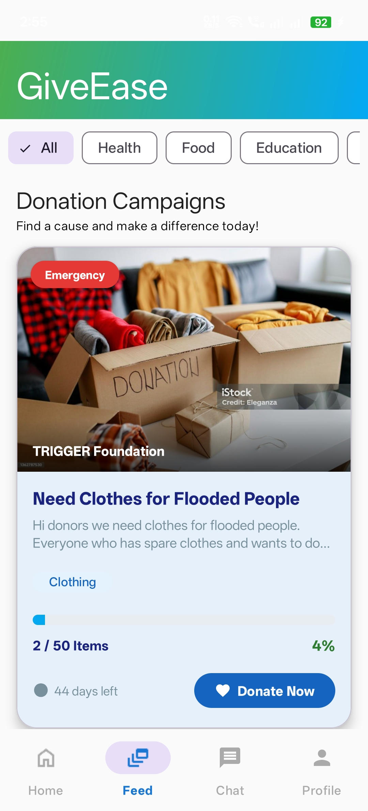
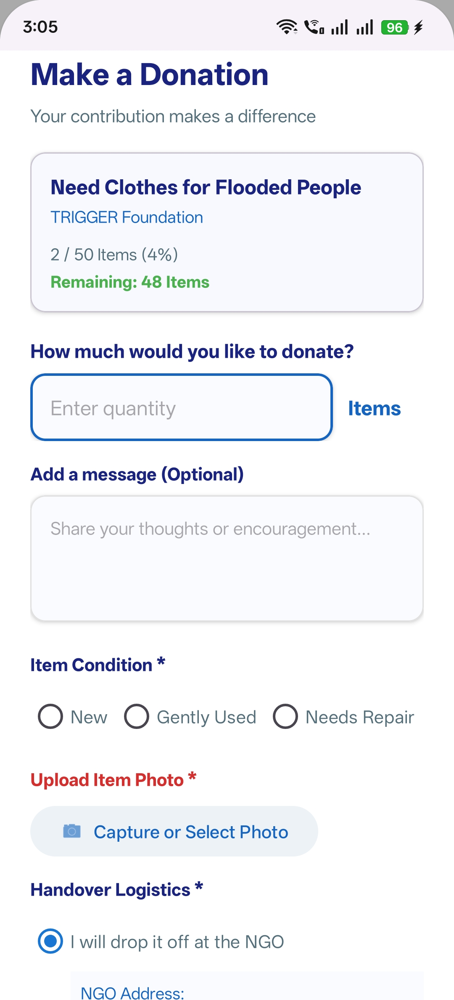
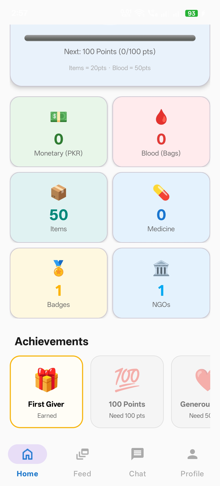
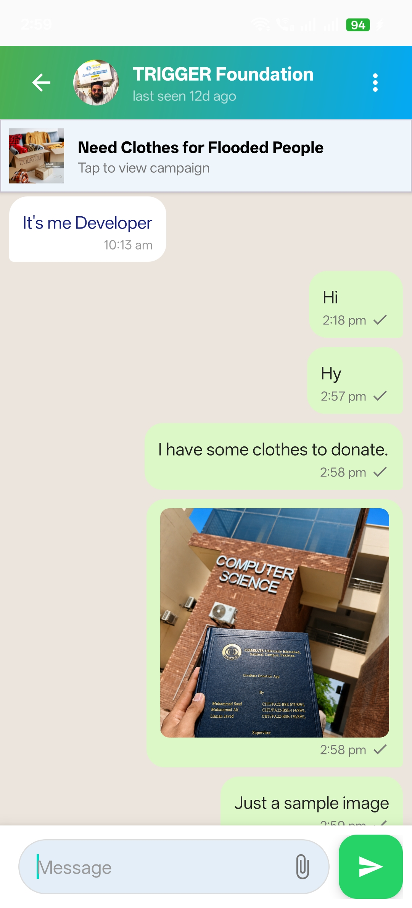
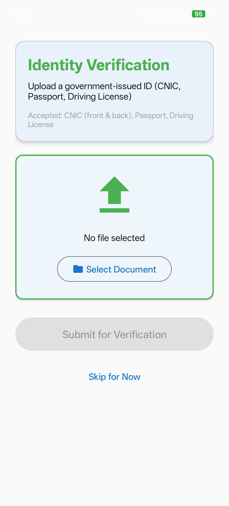
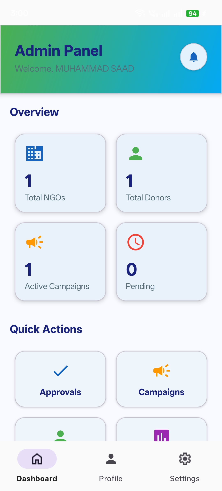
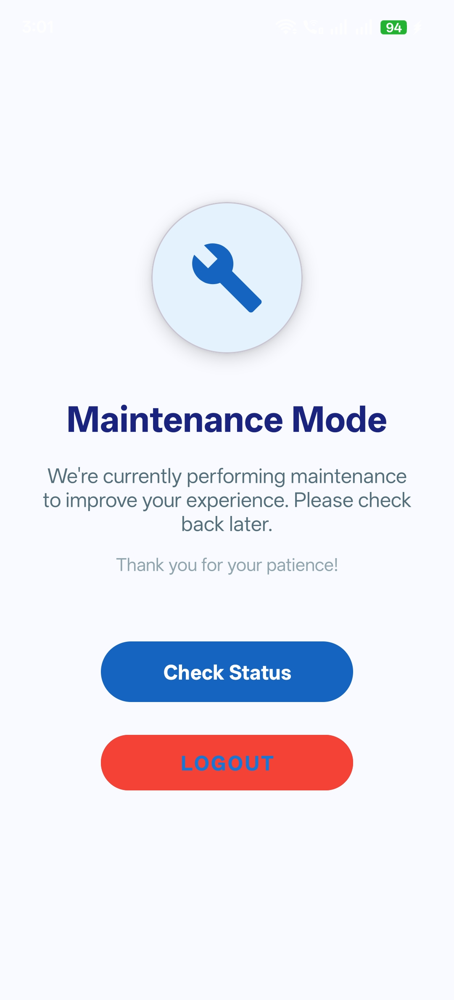
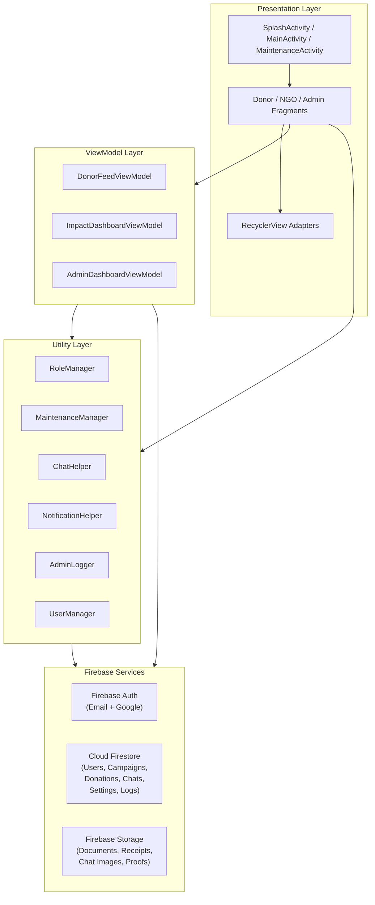

<p align="center">
  <h1 align="center">GiveEase</h1>
  <p align="center">
    A trust-first donation platform connecting verified donors with registered NGOs across Pakistan.
  </p>
</p>

<p align="center">
  
  
  
  
  
  
</p>

---

## Why GiveEase?

In Pakistan, charitable giving is deeply cultural — but trust is the biggest barrier. Donors don't know if their money reaches the right hands. NGOs struggle to prove legitimacy. There's no single platform that verifies both sides, handles multiple donation types, and provides transparent proof of delivery.

**GiveEase solves this** with a three-way verification system: donors verify identity via CNIC upload, NGOs verify through government registration documents, and every monetary donation requires bank receipt verification before funds are counted. The admin panel acts as a human-in-the-loop gatekeeper — no unverified user can donate or create campaigns.

---

## Key Features

### Donor

- **Browse & filter campaigns** — explore active campaigns by category (Food, Medical, Education, Clothing, Blood Donation, Monetary Funds, Disaster Relief, and more)
- **Multi-type donations** — donate physical goods (with item condition, photo upload, pickup/drop-off preference) or monetary funds (bank transfer with receipt upload)
- **Identity verification** — upload CNIC/passport/driving license; admin-reviewed before donation access is granted
- **Impact Dashboard** — animated KPIs showing monetary contributions, blood donations, physical items, medicine donated, badges earned, NGOs helped, people impacted, and monthly/yearly breakdowns
- **Gamified badges** — earn First Giver, 100 Points, Generous Heart, Rising Star, Hero Badge, and Platinum based on donation count and impact score
- **Real-time chat** — message NGOs directly per campaign with text + image sharing, typing indicators, online/offline status, read receipts, and full-screen image viewer
- **Save campaigns** — bookmark campaigns for later
- **Donation history** — track all past donations with status (Pending, Completed, Delivered, Rejected)
- **View delivery proof** — see NGO-submitted handover photos and beneficiary details for your donations
- **In-app notifications** — real-time unread badge counts, verification updates, donation confirmations
- **Contact support** — submit categorized support tickets (Payment Issues, Account Access, Technical, etc.) with FAQ access
- **NGO public profiles** — view any NGO's profile and campaigns before donating

### NGO

- **Create campaigns** — multi-image upload (auto-compressed), urgency levels (Low/Medium/High/Emergency), category selection, target quantities with unit types (Items, Kg, Liters, PKR, etc.), auto-close on goal completion
- **Manage campaigns** — edit, pause, view campaign progress with donor counts
- **Verify monetary donations** — review bank transfer receipts, accept or reject with notifications sent to donors
- **Manage physical donations** — track incoming items, verify condition
- **Upload delivery proof** — capture handover photo + address proof via camera, attach beneficiary name and contact, mark donations as "Delivered"
- **Bank account management** — add multiple bank accounts (bank name, title, IBAN) displayed to donors during monetary donations
- **Real-time chat** — communicate with donors per campaign
- **Dashboard** — active campaigns count, total donations received, recent campaign progress with shimmer loading
- **Identity verification** — upload government registration documents + registration number for admin review

### Admin

- **Dashboard** — total NGOs, total donors, pending approvals, active campaigns, unread notifications, and 7-day activity feed (recent verifications, donations, campaigns)
- **Verification queue** — review pending CNIC/NGO document submissions, approve or reject with mandatory rejection reasons, notifications sent automatically
- **Campaign review** — oversee all campaigns across the platform
- **User management** — view and manage all registered users
- **Donation tracker** — monitor all donation flows system-wide
- **Support tickets** — review and respond to user-submitted support tickets
- **Reports** — view flagged content and platform reports
- **System logs** — audit trail of all admin actions (approvals, rejections, settings changes) via `AdminLogger`
- **Maintenance mode** — one-toggle switch blocks all donors/NGOs instantly; only admins retain access; real-time listener auto-redirects active users to maintenance screen
- **Data export** — export users and donations as CSV files via Android share sheet
- **Settings** — email/push notification toggles, auto-approve toggle, about dialog

---

## Tech Stack

| Layer | Technology |
|-------|-----------|
| **Language** | Kotlin |
| **UI** | XML Layouts, ViewBinding, DataBinding, Material Design 3 |
| **Architecture** | MVVM (ViewModels with LiveData + Coroutines) |
| **Authentication** | Firebase Auth (Email/Password + Google Sign-In) |
| **Database** | Cloud Firestore (with persistent offline cache) |
| **File Storage** | Firebase Storage (images auto-compressed before upload) |
| **Real-time** | Firestore snapshot listeners (chat, notifications, maintenance mode) |
| **Navigation** | Fragment-based with Material Shared Axis transitions |
| **Image Loading** | Glide 4.16 + PhotoView (pinch-to-zoom) |
| **UI Effects** | Facebook Shimmer, SwipeRefreshLayout, animated counters |
| **Build System** | Gradle KTS with version catalog |

---

## Screenshots

| Donor Home | Campaign Feed | Donation Flow |
|:---:|:---:|:---:|
|  |  |  |

| Impact Dashboard | Chat | Verification |
|:---:|:---:|:---:|
|  |  |  |

| NGO Home | Admin Panel | Maintenance |
|:---:|:---:|:---:|
|  |  |  |

---

## Architecture Overview

GiveEase follows **MVVM** with Firebase as the backend-as-a-service. ViewModels (`ImpactDashboardViewModel`, `DonorFeedViewModel`, `AdminDashboardViewModel`) manage state via `LiveData`, with Kotlin coroutines for async Firebase operations. The `GiveEaseApplication` class initializes Firestore with persistent local caching for offline resilience.



**Key data flows:**
- **Auth** → `RoleManager` checks Firestore for user role → routes to Donor/NGO/Admin main fragment
- **Maintenance** → `MaintenanceManager` uses Firestore snapshot listener on `settings/app_config` → redirects non-admin users in real-time
- **Chat** → `ChatHelper` creates/opens Firestore chat rooms → messages stored as subcollections with real-time listeners
- **Notifications** → `NotificationHelper` writes to per-user `notifications` subcollection → snapshot listeners update badge counts
- **Verification** → Documents uploaded to Storage → URL saved in Firestore → Admin reviews and updates status → User notified

---

## Getting Started

### Prerequisites

- Android Studio Hedgehog (2023.1.1) or later
- JDK 8+
- A Firebase project with Auth, Firestore, Storage enabled

### Setup

```bash
# 1. Clone the repository
git clone https://github.com/chsaad-dev/GiveEase.git
cd GiveEase

# 2. Open in Android Studio
# File → Open → select the GiveEase directory

# 3. Add Firebase configuration
# Download google-services.json from your Firebase Console
# Place it in: app/google-services.json
```

### Firebase Configuration

1. Create a Firebase project at [console.firebase.google.com](https://console.firebase.google.com)
2. Enable **Authentication** → Email/Password + Google Sign-In
3. Enable **Cloud Firestore**
4. Deploy the included `firestore.rules` via Firebase CLI:
   ```bash
   firebase deploy --only firestore:rules
   ```
5. Enable **Firebase Storage**
6. Add your Android app with package name `com.example.giveease`
7. Add your **SHA-1** fingerprint (required for Google Sign-In)
8. Download `google-services.json` → place in `app/`
9. Create a Firestore document at `settings/app_config` with field `maintenanceMode: false`
10. Create an admin user manually in Firestore: set `role: "admin"` on a user document

### Build & Run

```bash
# Build debug APK
./gradlew assembleDebug

# Or run directly from Android Studio on an emulator/device (API 29+)
```

---

## Project Structure

```
app/src/main/java/com/example/giveease/
├── GiveEaseApplication.kt        # App-level Firebase + Firestore cache init
├── MainActivity.kt               # Role-based fragment routing + maintenance listener
├── SplashActivity.kt             # Animated splash → role check → navigation
├── MaintenanceActivity.kt        # Maintenance mode screen with real-time unlock
├── AppNavigation.kt              # Centralized role-to-fragment routing helper
│
├── auth/                          # Login + Signup (Email/Password, Google, email verification)
│   ├── LoginFragment.kt
│   └── SignupFragment.kt
│
├── donor/                         # Full donor experience
│   ├── DonorMainFragment.kt       # Bottom nav host (Home, Feed, Chat, Profile)
│   ├── DonorHomeFragment.kt       # Dashboard with stats, featured campaign, recent activity
│   ├── DonorFeedFragment.kt       # Campaign browsing with category filters
│   ├── DonorFeedViewModel.kt      # Campaign loading, filtering, offline handling
│   ├── CampaignDetailsFragment.kt # Full campaign view with donate action
│   ├── DonationDialogFragment.kt  # Bottom sheet for monetary/physical donations
│   ├── DonationHistoryFragment.kt # Past donation tracking
│   ├── DonorViewProofFragment.kt  # View NGO delivery proof for a donation
│   ├── ImpactDashbaordFragment.kt # Animated KPIs, badges, category breakdown
│   ├── ImpactDashboardViewModel.kt# Impact score calculation, badge logic
│   ├── DonorChatFragment.kt       # Chat list for donor
│   ├── ChatDetailFragment.kt      # Real-time messaging with image sharing
│   ├── SavedCampaignsFragment.kt  # Bookmarked campaigns
│   ├── NgoPublicProfileFragment.kt# View NGO profiles
│   ├── DonorProfileFragment.kt    # Donor profile view
│   ├── EditProfileFragment.kt     # Edit profile with image upload
│   ├── DonorSettingsFragment.kt   # Settings, theme, notifications
│   ├── ContactSupportFragment.kt  # Support ticket submission
│   ├── FAQFragment.kt             # Frequently asked questions
│   ├── ImageViewerFragment.kt     # Full-screen image viewer with PhotoView zoom
│   └── adapter/                   # Campaign, chat, and image slider adapters
│
├── ngo/                           # Full NGO experience
│   ├── NgoMainFragment.kt         # Bottom nav host (Home, Campaigns, Chat, Profile)
│   ├── NgoHomeFragment.kt         # Dashboard with stats, recent campaign, quick actions
│   ├── CreateCampaignFragment.kt  # Campaign creation with multi-image, urgency, categories
│   ├── EditCampaignFragment.kt    # Edit existing campaigns
│   ├── MyCampaignsFragment.kt     # All campaigns with status management
│   ├── ManageCampaignsFragment.kt # Campaign management actions
│   ├── MonetaryVerificationFragment.kt # Verify/reject bank transfer receipts
│   ├── NgoPhysicalDonationsFragment.kt # Manage incoming physical donations
│   ├── NgoUploadProofFragment.kt  # Camera-based delivery proof capture
│   ├── NgoBankAccountsFragment.kt # Add/manage multiple bank accounts
│   ├── NgoChatFragment.kt         # Chat list for NGO
│   ├── ChatDetailFragment.kt      # NGO-side chat
│   ├── NgoProfileFragment.kt      # NGO profile
│   ├── NgoEditProfileFragment.kt  # Edit NGO profile
│   ├── NgoHistoryFragment.kt      # Donation history received
│   ├── NgoSettingsFragment.kt     # NGO settings
│   ├── CampaignData.kt            # Campaign data class with progress/expiry helpers
│   └── model/                     # Campaign, chat, message, stats models
│
├── admin/                         # Full admin panel
│   ├── AdminMainFragment.kt       # Bottom nav host (Dashboard, Settings, Profile)
│   ├── AdminDashboardFragment.kt  # Stats overview + quick action buttons
│   ├── AdminDashboardViewModel.kt # Cached dashboard data with activity feed
│   ├── VerificationApprovalsFragment.kt # Approve/reject identity verifications
│   ├── AdminCampaignReviewFragment.kt   # Review all campaigns
│   ├── ManageUsersFragment.kt     # User management
│   ├── AdminDonationTrackerFragment.kt  # System-wide donation tracking
│   ├── AdminSupportTicketsFragment.kt   # Handle support tickets
│   ├── AdminReportsFragment.kt    # Flagged content reports
│   ├── AdminLogsFragment.kt       # Audit log viewer
│   ├── AdminSettingsFragment.kt   # Maintenance toggle, data export, logout
│   ├── AdminProfileFragment.kt    # Admin profile management
│   ├── AdminLogger.kt             # Centralized audit logging to Firestore
│   └── *Adapter.kt                # Various RecyclerView adapters
│
├── verification/
│   └── IdentityVerificationFragment.kt  # CNIC/NGO doc upload → Storage → admin notification
│
├── model/                         # Shared data models
│   ├── ChatRoom.kt                # Chat room with typing/online/unread state
│   └── Message.kt                 # Message with type (TEXT/IMAGE) and status enums
│
├── models/
│   ├── DonationProof.kt           # Delivery proof (beneficiary, photos, timestamps)
│   └── Notification.kt            # Notification model
│
├── ui/                            # Shared UI components
│   ├── NotificationsFragment.kt   # Notification center
│   ├── NotificationsAdapter.kt
│   └── OurTeamFragment.kt         # About the team
│
├── adapter/                       # Shared adapters
│   ├── ChatAdapter.kt             # Chat list adapter with unread badges
│   └── MessageAdapter.kt          # Message bubbles with image support
│
└── utils/                         # Utility classes
    ├── RoleManager.kt             # Coroutine-based role lookup from Firestore
    ├── MaintenanceManager.kt      # Real-time maintenance mode via snapshot listener
    ├── ChatHelper.kt              # Chat room creation/lookup helper
    ├── NotificationHelper.kt      # Write notifications to user subcollections
    ├── UserManager.kt             # SharedPrefs-backed user ID/name cache
    ├── NetworkUtils.kt            # Connectivity check
    └── AnimUtils.kt               # Button press animations
```

---

## Roadmap

- **AI-powered verification** — integrate document OCR and face-matching to auto-verify CNIC/registration documents, reducing admin bottleneck
- **Offline-first architecture** — leverage Firestore's local cache more aggressively with optimistic UI updates and queued mutations for areas with poor connectivity
- **Push notifications via FCM** — the notification infrastructure (subcollections, badge counts) is already built; add Firebase Cloud Messaging for background push delivery

---

## Contributing

1. Fork the repository
2. Create a feature branch (`git checkout -b feature/your-feature`)
3. Commit your changes (`git commit -m 'Add your feature'`)
4. Push to the branch (`git push origin feature/your-feature`)
5. Open a Pull Request

Please follow the existing code style: Kotlin with ViewBinding, MVVM pattern, and Firebase-first backend approach.

---

## License

This project is licensed under the MIT License — see the [LICENSE](LICENSE) file for details.

## Author

**Muhammad Saad** — [@chsaad-dev](https://github.com/chsaad-dev)

Built with ❤️ for Pakistan's charity ecosystem.
